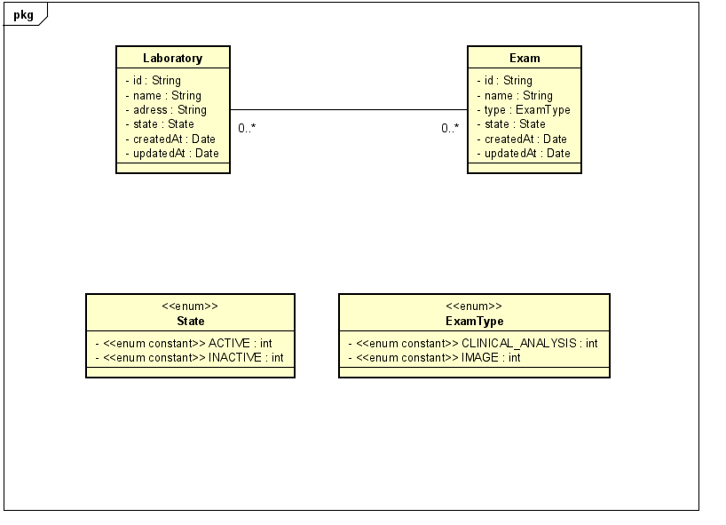

# Lab Api

 O contexto dessa aplicação é uma API REST para a manutenão de laborátórios e exames.

## Índice

1. [Visão geral](#visao)
0. [Executando o projeto localmente](#exclocal)
0. [Deploy](#deploy)
0. [Requisitos da aplicação](#req)
0. [Estrutura da aplicação](#estutura)
0. [Documentação](#docs)

<div id = 'visao'>

### Visão geral

O projeto foi desenvolvido utilizando o [Typescript](https://www.typescriptlang.org/) e o [NodeJs](https://nodejs.org/en/). O framework utilizado foi o [ExpressJs](https://expressjs.com/), o ORM (_Object Relational Mapper_) utilizado foi o [Prisma](https://www.prisma.io/) e o banco de dados foi o PostegreSQL que está num container do [Docker](https://www.docker.com/).

<div id="exclocal">

### Executando o projeto localmente

Primeiramente deve se ter instalado na máquina o [NodeJs](https://nodejs.org/en/), preferencialmente o [Yarn](https://classic.yarnpkg.com/lang/en/docs/install/#debian-stable), e o [Docker](https://www.docker.com/).
Segundo passo é executar os comandos de instalação de dependencias:

```console
user@user:~$ yarn
```

ou

```console
user@user:~$ npm install
```

Esse comando irá gerar a pasta node_modules no projeto que contém essas dependências que se encontram no arquivo package.json:

```javascript
"dependencies": {
    "@prisma/client": "^3.8.1",
    "@types/swagger-ui-express": "^4.1.3",
    "cors": "^2.8.5",
    "dotenv": "^14.2.0",
    "express": "^4.17.2",
    "express-async-errors": "^3.1.1",
    "swagger-ui-express": "^4.3.0"
  },
  "devDependencies": {
    "@types/cors": "^2.8.12",
    "@types/express": "^4.17.13",
    "prisma": "^3.8.1",
    "ts-node-dev": "^1.1.8",
    "typescript": "^4.5.5"
  }
```

Proximo passo é pegar o aqruivo .env.exemple e transformar ele num .env; após isso substituir as variáveis de DATABASE_URL pelas variáveis de conexão com o banco de dados encontradas no arquivo docker-compose.yml. Após isso execute a função que executa as migrações do Prisma:

```console
user@user:~$ yarn migrate
```

ou

```console
user@user:~$ npm run migrate
```

Isso criará todas as tabela no banco de dados.<br/><br/>
Após execute o comando para executar a API:

```console
user@user:~$ yarn dev
```

ou

```console
user@user:~$ npm run dev
```

A aplicação estará sendo executada na porta 7000 do seu localhost.

</div>

<div id='deploy'>

### Deploy

A aplicação está hospedada no serviço de cloud [Heroku](https://dashboard.heroku.com/); acessado o endpoint https://labapinode.herokuapp.com/ terá um _Hello world_ que mostra que aplicação está funcionando.

</div>

<div id = 'req'>

### Requisitos da aplicação

A aplicação possui de 3 entidades, sendo elas: Exame, Laboratório e uma entidade que representa a associação de Exames e Laboratório.<br/>

Sobre Exame, o usuário pode: criar exames, listrar exames ativos, deletar exame ativo, atualizar um exame, e buscar um exame pelo nome e assim obter além dos dados desse exame a lista de laborátorios associados a ele, já que um exame pode estar associado a vários laboratórios e os laboratórios possuem vários exames.<br/>

Sobre Laboratório, o usuário pode: criar laboratório, listrar laboratórios ativos, deletar laboratório ativo e atualizar um laboratório.<br/>

A imagem abaixo representa por meio de um diagrama de classes UML entidades e os relacionamentos entre eles.<br/>



</div>

<div id="estutura">

### Estrutura da aplicação

```yml
-dist
#após executar yarn tsc é gerado esta pasta com os arquivos transpilados de typescript para javascript que serão os códigos que estarão sendo executados no deploy

-docs
#documentos e imagens

-node_modules
#onde estarão as dependências baixadas 

-prisma
#contem a pasta migrations e o arquivo schema.prisma que serve para definir as tabelas do banco de dados
  -migrations
  #tera várias pastas com arquivos .sql. É o histórico de migrações     criadas pelo ORM Prisma

-src
#arquivos typescript do projeto

  -config
      #configurações e definições

      -errors
        #contem um arquivo que é uma classe para modelar erros previstos no sistema
    
  -modules
  #para cada entidade se cria um modulo e dentro desse modulo há controladores, services e routes

    -exam
    #tudo refrente a entidade Exame

      -controllers
      #O controle deve se preocupar em aceitar a solicitação, repassar para o serviço de domínio correto, processe a solicitação e entregue a resposta ao cliente.

      -service
      #Essa camada é um design pattern que ajuda a abstrair suas regras de negócio, deixando sua controller mais limpa e com a responsabilidade única.

      -routes
      #Tem as definições de rota referentes a Exames

    -laboratory
      #contem a mesma estrutura acima

    -associateExamLab
      #contem a mesma estrutura de exam

  -prisma
    #configuração do PrismaClient para fazer as querys nos services

  -routes
    #contem o arquivo routes.ts que une os outros demais routes da aplicação

  server.ts
    #arquivo que inicia a aplicação

```     

Essa estrutura é baseada nesse artigo https://medium.com/@diomalta/como-organizar-e-estruturar-projetos-com-node-js-4845be004899 e pode ser encontrada em vários cursos na web.

</div>

<div id = 'docs'>

### Documentação

A documentação desse projeto pode ser encontrada executando o projeto e em seguinda acessando o endpoint **`http://localhost:7000/api-docs`**. Ou como já foi feito o deploy da aplicação basta acessar https://labapinode.herokuapp.com/api-docs/ e mudar o server para o server de deploy.


</div>
